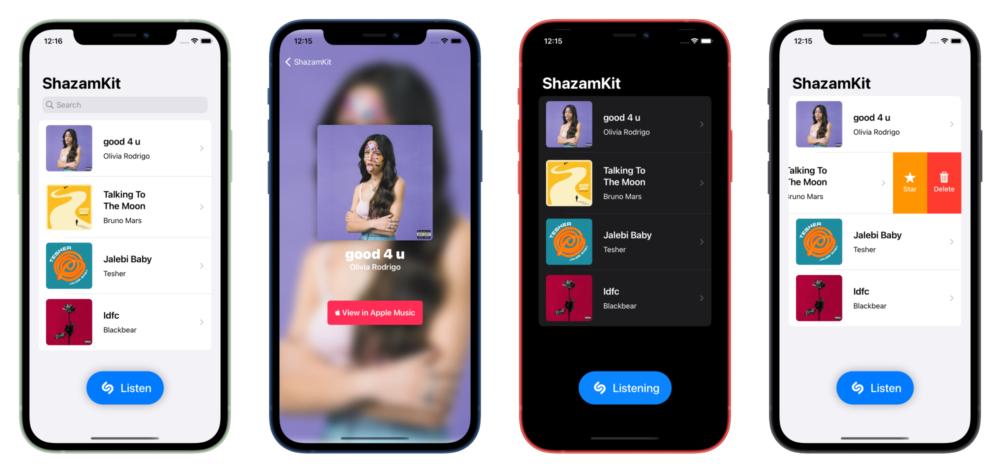

   
 <br>
   

```Swift
import SwiftUI
import ShazamKit

class ShazamController: NSObject, ObservableObject, SHSessionDelegate {
    
    // MARK: - PRIVATE VARIABLES
    private let audioEngine = AVAudioEngine()
    private let signatureGenerator = SHSignatureGenerator()
    private let session = SHSession()
    private let audioSession = AVAudioSession.sharedInstance()
    
    // MARK: - INITIALIZE
    override init() {
        super.init()
        initialSetup()
    }
    
    func initialSetup() {
        self.session.delegate = self
        self.audioSession.requestRecordPermission { _ in }
    }
    
    func listen() {
        /// SETUP
        try! audioSession.setActive(true, options: .notifyOthersOnDeactivation)
        let inputNode = self.audioEngine.inputNode
        let recordingFormat = inputNode.outputFormat(forBus: 0)
        
        /// PREPARE
        inputNode.removeTap(onBus: 0)
        inputNode.installTap(onBus: 0, bufferSize: 1024, format: recordingFormat) { (buffer: AVAudioPCMBuffer, when: AVAudioTime) in
            try! self.signatureGenerator.append(buffer, at: nil)
            self.session.matchStreamingBuffer(buffer, at: nil)
        }
        
        /// START
        self.audioEngine.prepare()
        try! self.audioEngine.start()
    }
    
    func session(_ session: SHSession, didFind match: SHMatch) {
        guard let song = match.mediaItems.first else { return }
        self.audioEngine.stop()
        print("SONG FOUND: \(song.title ?? "NO TITLE")")
    }
}
```
